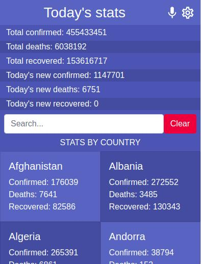
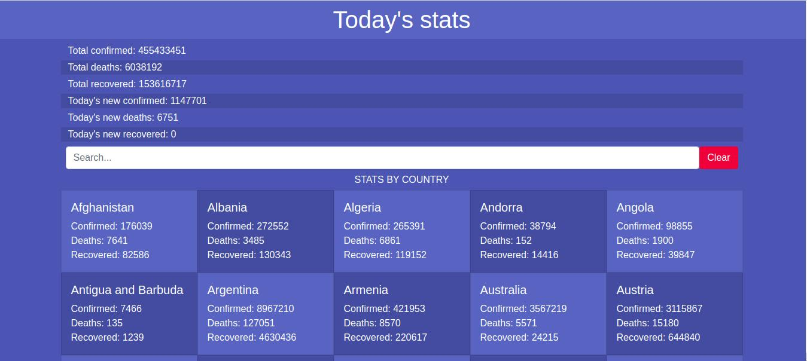

# Covid-19 Metrics Tracker

This is a mobile web application that features 2 pages: The homepage and the details page. The homepage displays all today's statistics about confirmed cases, deaths, and recoveries caused by Covid-19 in the world, as a total and separated by countries. When the user clicks on any country, the website navigates to the details page, which contains the detailed statistics about that specific country as a total and separated by regions. The home page contains a search bar that allows the user to filter by country name. The data is consumed from [Narrativa API](https://covid19tracking.narrativa.com/index_en.html).

## Mobile



## Desktop



## ⚒️  Built with

- React
- Redux
- Bootstrap
- Vim
- Git & GitHub

## 🖥️ Live Demo
[Live demo link]() :point_left:

## 🖥️ Video Presentation
[Presentation](https://www.loom.com/share/18031b26c52f4cb995496516577dcb94) :point_left:

## Getting Started

To get a local copy up and running on your machine, follow these simple steps.
Enter this in your terminal 👇 
``` 
  git clone git@github.com:Qoosim/react-capstone-metrics-webapp.git 
``` 
## 🛠️ Prerequisites
```
  Install Node.js on your machine
```
## 🕹️ Setup
```
  Clone the repository on your machine and cd into it
  run npm install
  run npm run start
```
## Author

👤 **Qoosim AbdulGhaniyy**

- GitHub: [Qoosim](https://github.com/Qoosim)
- LinkedIn: [Qoosim](https://www.linkedin.com/in/qoosim)

## 🤝 Contributing

Contributions, issues, and feature requests are welcome!

Feel free to check the [issues page](../../issues/).

## Show your support

Give a ⭐️ if you like this project!

## Acknowledgments

- Original design idea by [Nelson Sakwa on Behance](https://www.behance.net/sakwadesignstudio).

- To those assist in understanding the concept of React 

## 📝 License

This project is [MIT](./MIT.md) licensed.

